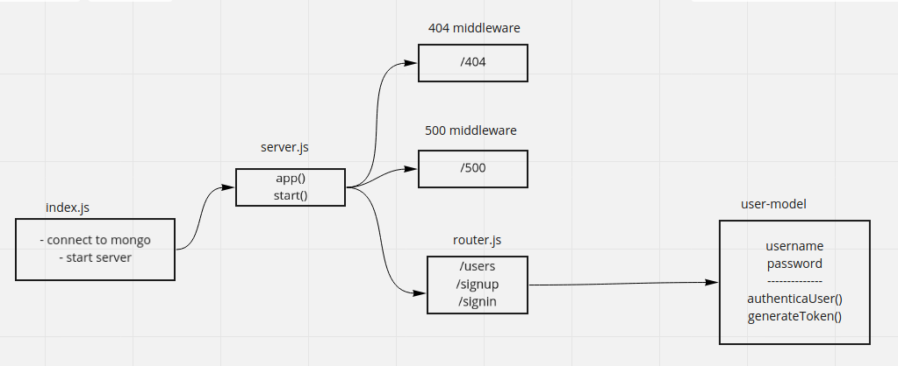

# auth-server

### api-resource
```javascript
GET /users var payload = {}  return [users]
POST /signup var payload = { username, password } return user;
POST /signin var payload = { username, password } return { user, token }
// test purpose
POST /secret var payload = {} return { user }
// test crud
GET /read var payload = {}  return {};
POST /create var payload = {} return {};
PUT /update var payload = {} return {}
DELETE /delete var payload = {} return {}
// oauth
GET / var payload = {} return "index.html"
GET /oauth var payload = {} return [user, token];
```

### UML



### **.env**
```env
PORT=3000
MONGOOSE_URL=mongodb://localhost:27017/auth_server
JWT_SECRET_KEY="SECRET"
```

### package.json scripts
#### start
```sh
npm start # node index.js
```
#### dev
```sh
npm run dev # nodemon index.js
```
#### test
```sh
npm test # jest --coverage --verbose
```
#### lint
```sh
npm run lint # eslint './**/*.js' --ignore-pattern node_modules/
```
